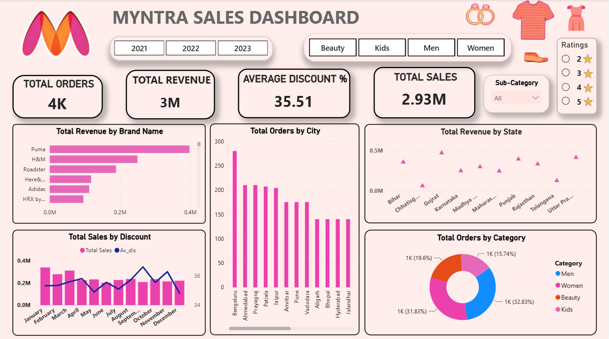

# 🛍️ Myntra Sales Dashboard

An interactive sales analytics dashboard built on Myntra e-commerce data, covering **2021–2023**. It tracks orders, revenue, discounts, and customer ratings across brands, categories, cities, and states — helping visualize sales performance and trends at a glance.

---

## Overview

This dashboard answers key business questions such as:

- Which brands and categories drive the most revenue?
- How do sales and discounts trend month over month?
- Which cities and states generate the most orders/revenue?
- How are orders distributed across categories (Men, Women, Kids, Beauty)?
- How do customer ratings vary across products?

**Filters available:** Year (2021 / 2022 / 2023), Brand (Puma, Adidas, H&M, HRX), Category (Beauty, Kids, Men, Women), Sub-Category, and Rating (2–5 stars).

---

## Key Metrics (KPIs)

| Metric | Value |
|---|---|
| Total Orders | ~4K |
| Total Revenue | ~3M |
| Average Discount | 35.51% |
| Total Sales | 2.93M |

---

## Visuals Included

- **Total Revenue by Brand Name** — horizontal bar chart comparing brand performance (Puma, H&M, Roadster, HereAndNow, Adidas, HRX)
- **Total Orders by City** — bar chart ranking top cities (Bengaluru, Ahmedabad, Prayagraj, Patiala, Jaipur, and more) by order volume
- **Total Revenue by State** — scatter plot of revenue across Indian states
- **Total Sales by Discount** — combo chart tracking monthly sales alongside average discount trend
- **Total Orders by Category** — donut chart showing the order split between Men, Women, Kids, and Beauty

---

## Dataset Structure
The dataset (`Myntra_dataset.xlsx`) follows a **star schema** with three tables:

### `dim_products` (3,071 rows)
| Column | Description |
|---|---|
| Product ID | Unique product identifier |
| Category | Men / Women / Kids / Beauty |
| Sub-category | e.g. Topwear |
| Product Name | e.g. T-Shirts |
| Brand Name | Puma, Adidas, H&M, Roadster, HRX, etc. |
| Size | Product size |
| Color | Product color |
| Ratings | Customer rating (2–5) |

### `dim_customers` (100 rows)
| Column | Description |
|---|---|
| Customer ID | Unique customer identifier |
| Customer Age | Age of customer |
| City | Customer's city |
| State | Customer's state |

### `fact_orders` (3,500 rows)
| Column | Description |
|---|---|
| Order ID | Unique order identifier |
| Customer ID | Links to `dim_customers` |
| Product ID | Links to `dim_products` |
| Date | Order date (2021–2023) |
| Original Price | Price before discount |
| Discount% | Discount applied to the order |

**Relationships:** `fact_orders.Customer ID → dim_customers.Customer ID` and `fact_orders.Product ID → dim_products.Product ID` (many-to-one, standard star schema).

---

## Tools Used

- **Data modeling:** Star schema (fact + dimension tables) in Excel
- **Dashboard/Visualization:** Power BI (or your preferred BI tool)
- **Data source:** `Myntra_dataset.xlsx`

---

## How to Use

1. Clone this repository.
2. Open `Myntra_dataset.xlsx` to explore the raw data (3 sheets: `dim_products`, `dim_customers`, `fact_orders`).
3. Open the dashboard file in Power BI / your BI tool of choice.
4. Use the filters (Year, Category, Brand, Sub-Category, Ratings) to explore the data interactively.

---

## Insights at a Glance

- **Puma** leads in total revenue among all brands, followed by H&M.
- **Bengaluru** generates the highest number of orders by a wide margin.
- **Women's** category holds the largest share of total orders (~32.8%), closely followed by Men's (~31.8%).
- Average discount hovers consistently in the mid-30s% range across the year, with sales peaking mid-year.

---

## License

This project uses a sample/synthetic e-commerce dataset for educational and portfolio purposes.
